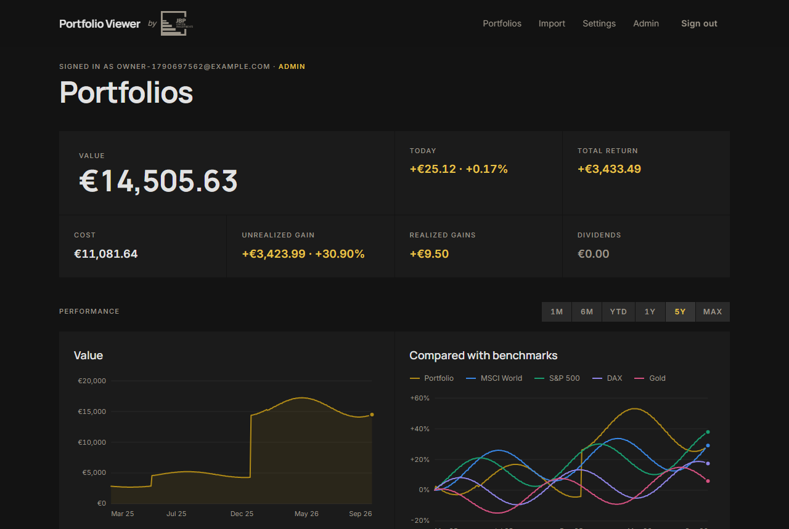
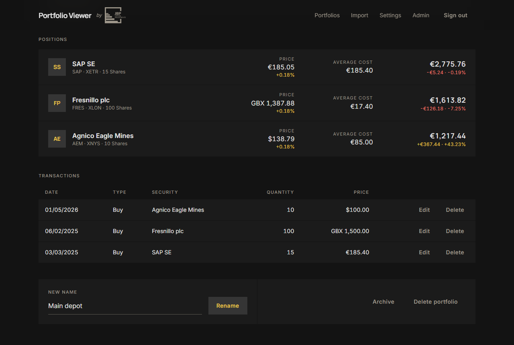
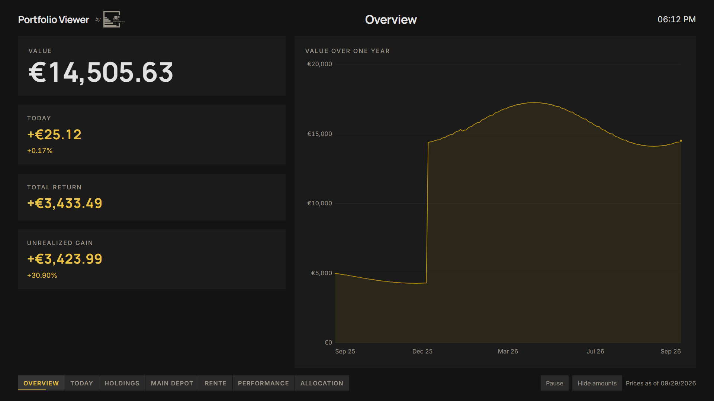

# Portfolio Viewer

Track your share portfolios on your own server. Record buys, sells and dividends. See today's value in your
own currency and compare your returns with the market. Put it all on the living-room TV.

By [JBP Capital](https://jbpcapital.de). Free software under the [GNU AGPL-3.0](LICENSE).



## Features

- **Portfolios and transactions:**
  - several portfolios per account
  - buys, sells, dividends, splits and mergers
  - holdings taken over from another bank
  - moves between your own portfolios
- **CSV import and export:** a preview before anything is stored; English and German number formats; an
  export that can be imported again.
- **Prices:**
  - ten years of daily closes for every security you hold, kept current while its exchange is open
  - any listing currency, London prices in pence included
  - everything converted into your base currency with the European Central Bank's rates
- **Returns and benchmarks:** time-weighted returns (deposits and withdrawals do not count as gains) from one
  month to since your first trade. They are compared with the MSCI World, the S&P 500, the DAX and gold.
- **Analysis:**
  - allocation by sector, currency and country
  - today's movers
  - a chart of today's holdings at past prices
- **TV mode:**
  - pair a TV with a six-character code; it shows your portfolios read-only
  - change views with the remote and open a security's detail
  - hide all amounts with one key
- **Android app** for phones and Android TV ([`apps/android`](apps/android/README.md)).
- **Languages:** English and German.
- **Accounts:** invite-only; the first account becomes the administrator.

| Portfolio | TV mode |
|---|---|
|  |  |

## Quick start

You need a computer or server with Docker and Docker Compose (Linux, macOS or Windows; amd64 or arm64) and
about 1 GB of free memory.

```sh
git clone https://github.com/JBP-Capital/portfolio-viewer.git
cd portfolio-viewer/deploy
cp .env.example .env
```

Open `.env` and fill in three values:
- `POSTGRES_PASSWORD`: create one with `openssl rand -hex 24`.
- `JWT_SECRET`: create one with `openssl rand -hex 32`.
- `PUBLIC_URL`: the address you will open in the browser, e.g. `http://localhost:3000`.

Then start it:

```sh
docker compose up -d
```

Open `PUBLIC_URL` and choose **Create account**. The first account becomes the administrator; after that
the instance is invite-only. Record your first purchase, and prices appear within a minute.

The first start downloads the published images. `docker compose up -d --build` builds them from this
repository instead.

## Documentation

- [Self-hosting guide](deploy/README.md): updates, backups, HTTPS, e-mail, prices, invitations, CSV
  format.
- [Android app](apps/android/README.md).
- [Contributing](CONTRIBUTING.md) and [reporting a vulnerability](SECURITY.md).

## Market data

By default prices come from Yahoo Finance and exchange rates from the European Central Bank. Both are free
for private use. You are responsible for complying with their terms. `MARKET_DATA_PROVIDER=demo` runs the
app with made-up prices and no internet access.

## License

Portfolio Viewer is licensed under the GNU Affero General Public License v3.0. Every page links to the
source code. If you run a modified version for other people, publish your changes and point `SOURCE_URL`
at them (see the [self-hosting guide](deploy/README.md#source-code-of-your-instance)).
